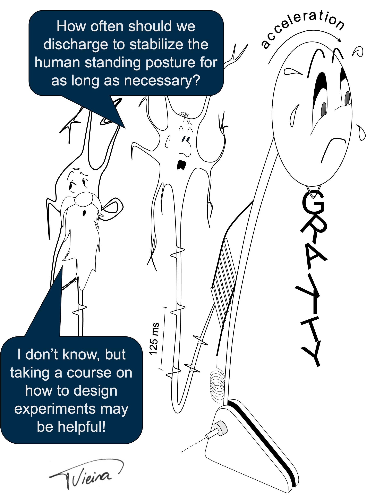

# Preface {.unnumbered}

\

{width=60% fig-align=center}

This book was developed specifically to support students attending the course **Experimental Design in Biomedical Engineering** at *Politecnico di Torino*. Its content, organization, and practical activities closely follow the structure of the course, integrating lectures with hands-on exercises designed to reinforce the concepts discussed in class. Nevertheless, I hope that students from other institutions, as well as colleagues involved in teaching or conducting biomedical research, may also find the material useful as an introduction to experimental design and statistical reasoning in the health sciences.

This book originated from two observations that have emerged over many
years of teaching and supervising Biomedical Engineering students.

The first concerns the way students approach scientific research. Many
are comfortable collecting data and exploring them in search of
interesting patterns. Exploratory analyses undoubtedly have their place,
particularly when learning a new experimental technique or becoming
familiar with an unfamiliar dataset. However, exploratory analyses
should not replace the scientific method.

Every scientific study should begin with a question.

A relevant scientific question motivates the entire experimental
process. The **Introduction** establishes why that question is worth
asking and presents the scientific evidence supporting the proposed
hypothesis. The **Methods** describe how the hypothesis will be tested,
requiring careful definition of the experimental design, appropriate
control of confounding variables, and rigorous data collection and
processing procedures. The **Results** present the evidence obtained,
reporting the findings objectively and without interpretation. Finally,
the **Discussion** critically examines whether the results support or
reject the original hypothesis and places those findings within the
context of the existing scientific literature.

Once this logical sequence is understood, experimental design becomes
far more than a collection of procedures. It becomes a structured way of
thinking scientifically.

The second motivation for writing this book arose from a gap I observed
in the education of Biomedical Engineering students. Although concepts
related to statistics are introduced throughout several courses, they
are often presented independently and with different objectives.
Students therefore become familiar with individual statistical
techniques but frequently lack a unified understanding of inferential
statistics, when different methods should be applied, and how their
results should be interpreted in the context of biomedical research.

This book was written to help bridge that gap.

Rather than presenting statistics as a collection of formulas to be
memorized, the book integrates experimental design, data acquisition,
data processing, statistical analysis, and scientific reporting into a
single coherent framework. The practical activities, based on postural
control experiments and implemented using the R programming language,
were designed to reinforce this integration by allowing students to
experience the complete research workflow---from formulating a hypothesis
to communicating scientific findings.

My hope is that this book helps its readers develop not only the technical skills required to perform statistical analyses, but also the critical thinking necessary to design meaningful experiments, interpret evidence responsibly, and communicate scientific discoveries with clarity and rigor.

Above all, I hope this book reminds its readers that every meaningful experiment begins not with data, nor with statistics, but with a well-formulated scientific question.

\vspace{2em}